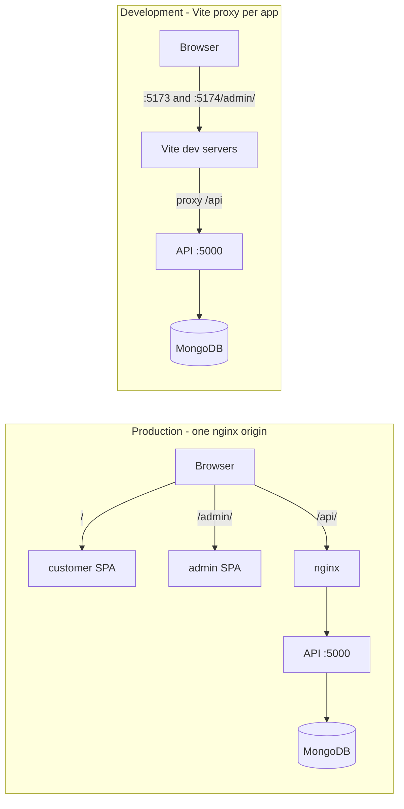

# Cafe Management System

A MERN stack cafe platform made of three independent applications that share one API
contract:

- **customer/** — React self-service kiosk (customer-facing)
- **admin/** — React admin dashboard (orders, kitchen display, inventory, register, reports)
- **server/** — Express + MongoDB REST API

It is designed to run as a **single same-origin stack**: in production nginx serves both
SPAs and proxies `/api` to the server, and in development each SPA uses a Vite proxy for
`/api`. Keeping everything same-origin means no CORS and first-party auth cookies that
work over plain HTTP — important for the isolated-LAN deployment described below.



## Tech Stack

| Layer | Technologies |
| --- | --- |
| Customer & Admin | React 19, Vite 8, React Router 7, Axios, ESLint, Prettier |
| Server | Node.js, Express, MongoDB 7, Mongoose, JWT, dotenv, CORS, Morgan |
| Deployment | Docker Compose, nginx |
| Testing | Vitest, Supertest, mongodb-memory-server |

## Project Structure

```text
cafe-management-system/
├── customer/           # Customer kiosk React app (dev port 5173)
├── admin/              # Admin React app (dev port 5174, served at /admin/)
├── server/             # Express API (port 5000)
├── deploy/             # nginx config, web image Dockerfile, mongo init script
├── scripts/            # backup.sh and other ops helpers
├── docker-compose.yml  # Production stack (mongo + api + web)
├── .env.example        # Compose/production configuration
├── package.json        # Root convenience scripts
└── README.md
```

## Prerequisites

- Node.js 20.19+ (Vite 8 requirement) and npm 10+
- MongoDB 7 (a local install, a Docker container, or Atlas)
- Docker + Docker Compose (only for the production/LAN deployment)

---

## Run on a single laptop (development)

Use this to check the UI and its functions locally. You will run three dev servers
(API, customer, admin) plus a MongoDB instance, all on one machine.

### 1. Start MongoDB

Simplest is a throwaway Docker container (no auth needed for local dev):

```bash
docker run -d -p 27017:27017 --name cafe-mongo mongo:7
```

(Or use an existing local MongoDB / Atlas connection string.)

### 2. Configure the server

```bash
cd server
cp .env.example .env
```

Set at minimum:

```
MONGODB_URI=mongodb://127.0.0.1:27017/cafe-management
JWT_SECRET=any-long-dev-secret
```

For the frontends, **do not create `customer/.env` or `admin/.env`** (or, if you do,
leave `VITE_API_BASE_URL=/api`). Keeping it relative routes API calls through the Vite
proxy so requests stay same-origin and the auth cookie works. Setting an absolute
`http://localhost:5000/api` bypasses the proxy and silently breaks admin login (the
`SameSite=Lax` cookie is not sent cross-site).

### 3. Install dependencies and seed the database

From the repository root:

```bash
npm run install:all
cd server && npm run seed && cd ..
```

Seeding creates a bootstrap admin (`admin@cafe.test` / `Admin123!`), a sample customer,
a self-service kiosk account, the starter menu, and sample inventory.

### 4. Run the three dev servers

In three terminals (or via the root scripts):

```bash
npm run dev:server     # API on http://localhost:5000
npm run dev:customer   # Kiosk on http://localhost:5173
npm run dev:admin      # Admin on http://localhost:5174/admin/
```

### 5. Check the UI and its functions

- **Customer kiosk** — open `http://localhost:5173/`
  - Pick an order type -> add items to the cart -> checkout.
  - Choose cashless (pick a method) or cash; confirm a **server order number** is shown.
- **Admin dashboard** — open `http://localhost:5174/admin/`
  - Log in with `admin@cafe.test` / `Admin123!`.
  - **Orders**: the kiosk order appears as `pending`.
  - **Kitchen Queue**: advance the order (pending -> preparing -> ready).
  - **Inventory**: add/edit/delete items — changes persist to the backend.
  - **Register**: place a dine-in order with a table number and send it to the kitchen.
- **API health** — `http://localhost:5000/api/health` should report `"database":"connected"`.

> Note: the admin dev server is served under `/admin/` (because the app is built with
> Vite `base: '/admin/'`). Open `http://localhost:5174/admin/`, not the bare port.

### Build, lint, and test

```bash
# From the repo root
npm run build:customer
npm run build:admin
npm run lint:customer
npm run lint:admin
npm run lint:server

# Backend tests (needs internet the first time to download the in-memory Mongo binary)
cd server && npm test
```

---

## Environment variables

### Server (`server/.env`)

| Variable | Description | Default |
| --- | --- | --- |
| `NODE_ENV` | Runtime environment | `development` |
| `PORT` | API server port | `5000` |
| `MONGODB_URI` | MongoDB connection string | required |
| `JWT_SECRET` | JWT signing secret | required |
| `JWT_EXPIRES_IN` | Token lifetime | `7d` |
| `COOKIE_SECURE` | Set the `Secure` cookie flag (needs HTTPS) | `false` |
| `COOKIE_SAMESITE` | Cookie `SameSite` policy | `lax` |
| `CLIENT_URL` / `ADMIN_URL` | Allowed origins for CORS (dev only) | `http://localhost:5173` / `5174` |
| `TAX_RATE` | Tax rate as a decimal | `0.12` |
| `SEED_ADMIN_*`, `SEED_KIOSK_*` | Seed account overrides | see `.env.example` |

`COOKIE_SECURE=false` is intentional for plain-HTTP LAN/dev use — browsers reject
`Secure` cookies over HTTP.

### Customer & Admin (`customer/.env`, `admin/.env`)

| Variable | Description | Default |
| --- | --- | --- |
| `VITE_API_BASE_URL` | API base path | `/api` (relative — keep it this way) |

---

## API Endpoints

| Group | Base Route | Access |
| --- | --- | --- |
| Auth | `/api/auth` | Public / Auth |
| Users | `/api/users` | Admin |
| Categories | `/api/categories` | Public read / Admin write |
| Products | `/api/products` | Public read / Admin write |
| Inventory | `/api/inventory` | Admin |
| Cart | `/api/cart` | Customer |
| Orders | `/api/orders` | Customer & Admin |
| Receipts | `/api/receipts` | Auth (PDF download) |
| Reports | `/api/reports` | Admin |
| Health | `/api/health` | Public |

Ordering entry points:

- `POST /api/orders` — authenticated customer checkout.
- `POST /api/orders/kiosk` — **public** self-service kiosk order (attributed to the
  seeded kiosk account, own rate limit).
- `POST /api/orders/register` — **admin** point-of-sale order (supports `tableNumber`,
  optional immediate `preparing` status).

See [`server/README.md`](./server/README.md) for the full endpoint reference.

---

## Production deployment — isolated LAN

This system targets an **isolated, router-less local network**: one server host on an
unmanaged switch, plus two laptops used purely as displays (customer kiosk and admin
dashboard). There is **no internet, no router, no DHCP, and no DNS**. The server runs the
whole stack with Docker Compose behind a single nginx origin.

```text
Client laptop ─┐
               ├─ Unmanaged switch ── Server (Docker: nginx + api + mongo)
Admin laptop ──┘
```

### 1. Network addressing (static IPs — no DHCP)

With no router there is no DHCP, so every NIC needs a **static IPv4** in the same subnet.
Leave gateway and DNS blank.

| Host | IP address | Subnet mask | Gateway | DNS |
| --- | --- | --- | --- | --- |
| Server | `192.168.1.100` | `255.255.255.0` | (blank) | (blank) |
| Admin laptop | `192.168.1.101` | `255.255.255.0` | (blank) | (blank) |
| Client laptop | `192.168.1.102` | `255.255.255.0` | (blank) | (blank) |

Verify connectivity from each laptop: `ping 192.168.1.100`.

### 2. Clock synchronization (no internet NTP)

There is no internet, so machines cannot reach public NTP. This matters because the
server clock stamps `createdAt` and drives JWT expiry, and the Kitchen Display
(`admin/src/pages/KitchenQueuePage.jsx`) computes an "elapsed minutes" chip as
`laptopNow - order.createdAt` — clock skew shows wrong minutes. Either set all three
clocks to the same time manually, or run a LAN NTP server on the host
(`chrony`/`ntpd` serving `192.168.1.0/24`) and point both laptops at `192.168.1.100`.

### 3. Offline artifact preparation

The deployment host is assumed offline, so bring images and dependencies over while a
machine still has connectivity. On an internet-connected machine:

```bash
# 1. Pull the base images
docker pull node:22-alpine
docker pull nginx:1.27-alpine
docker pull mongo:7

# 2. Install deps once in each app (refreshes lockfiles), then build the images
npm run install:all
docker compose build

# 3. Save everything into one tarball
docker save -o cafe-images.tar \
  node:22-alpine nginx:1.27-alpine mongo:7 \
  cafe-management-system-api cafe-management-system-web
```

Copy `cafe-images.tar` and the repo to the server via USB, then:

```bash
docker load -i cafe-images.tar
```

`docker compose up -d` then starts without reaching any registry.

### 4. First-time build and run on the server

```bash
cd /opt/cafe            # wherever the repo lives on the server
cp .env.example .env    # then edit secrets (see below)
docker compose build    # skip if images were loaded from the tarball
docker compose up -d
docker compose exec api npm run seed   # first run only
```

Open from the laptops:

- Customer kiosk: `http://192.168.1.100/`
- Admin dashboard: `http://192.168.1.100/admin/`
- API health: `http://192.168.1.100/api/health`

### 5. Secrets (root `.env`)

The Docker stack is configured entirely from the git-ignored root `.env`:

```
MONGO_DB=cafe-management
MONGO_ROOT_USERNAME=root
MONGO_ROOT_PASSWORD=<strong password>
MONGO_APP_USERNAME=cafe_app
MONGO_APP_PASSWORD=<strong password>
JWT_SECRET=<64+ random hex chars, e.g. `openssl rand -hex 32`>
COOKIE_SECURE=false
COOKIE_SAMESITE=lax
```

Compose builds the API's `MONGODB_URI` from these values, connecting as the
least-privilege `MONGO_APP_USERNAME` (created automatically on first startup with
`readWrite` on the app DB only). Mongo's `27017` is never published to the LAN.

### 6. Backups (local only)

There is no cloud, so back up to the server disk and copy to USB. A helper is provided:

```bash
./scripts/backup.sh     # writes a timestamped dump under ./backups
```

Schedule nightly with cron:

```
0 2 * * * cd /opt/cafe && ./scripts/backup.sh >> /var/log/cafe-backup.log 2>&1
```

Restore (uses the root credentials from `.env`):

```bash
source .env
docker compose exec -T mongo mongorestore \
  --username "$MONGO_ROOT_USERNAME" --password "$MONGO_ROOT_PASSWORD" \
  --authenticationDatabase admin --drop --gzip --archive < backups/<file>.archive.gz
```

### 7. Display laptops (kiosk mode)

Launch a browser full-screen at the server, auto-start on boot, and disable sleep.

```bash
# Client laptop (customer kiosk)
chrome --kiosk --incognito --noerrdialogs --disable-pinch "http://192.168.1.100/"

# Admin laptop
chrome --kiosk "http://192.168.1.100/admin/"
```

Windows: put a shortcut with the target in `shell:startup`. Linux: add it to the desktop
autostart. Disable power management so the screens never sleep (Windows: Power ->
Screen/Sleep = Never; Linux/GNOME: `gsettings set org.gnome.desktop.session idle-delay 0`).

### 8. Resilience

- All containers use `restart: unless-stopped`, so they recover after a crash.
- Enable Docker on boot (`systemctl enable docker`) so the stack survives power loss.
- Consider a small UPS on the server so an outage doesn't corrupt the database mid-write.

---

## Seed data

```bash
cd server
npm run seed
```

Creates a bootstrap admin (`admin@cafe.test` / `Admin123!`), a sample customer, the kiosk
account, a starter menu, and sample inventory. Override credentials via `SEED_*` in
`server/.env`.

## License

MIT — see [LICENSE](./LICENSE).
